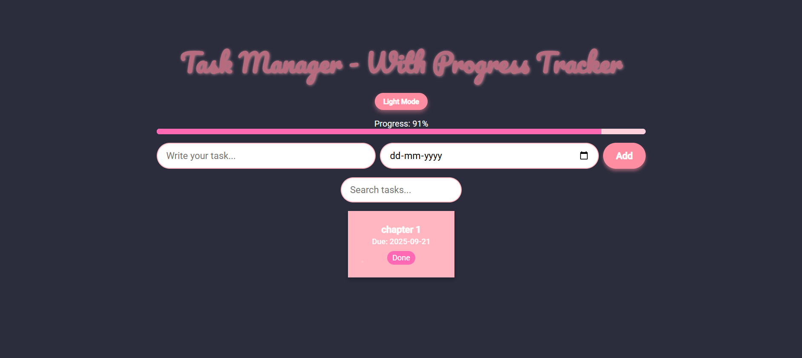
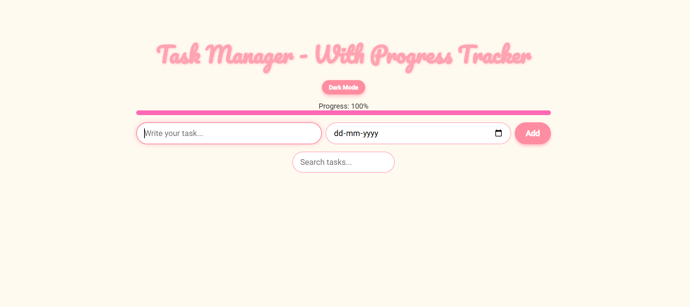

# 📌 Task Manager – With Progress Tracker

A beautiful, interactive **Task Manager Web App** built with **HTML, CSS, and JavaScript**.  
This project allows users to add, manage, and track tasks using sticky notes UI, dark mode, search & filter, reminders, and progress tracking.

---

## 🚀 Features

✅ Add, Edit & Delete Tasks with due dates  
🎨 Sticky Note Style UI with random pastel colors  
🌓 Dark Mode Toggle for a modern look  
🔎 Search, Filter, & Sort Tasks (by category/date)  
⏰ Task Reminders using browser notifications  
📊 Progress Tracker showing completion percentage  
🎉 Confetti Animation on completing tasks  
💾 LocalStorage Support – tasks are saved even after refreshing  
📱 Responsive Design – works on desktop & mobile  

---

## 🛠️ Tech Stack

- **HTML5** – Structure  
- **CSS3** – Styling, animations, dark mode  
- **JavaScript (ES6)** – Functionality, notifications, local storage  

---

## 📂 Project Structure
├── index.html # Main HTML file
├── style.css # CSS styling (integrated in HTML for now)
├── script.js # JavaScript functionality (integrated in HTML for now)
└── README.md # Project documentation


---

## ⚡ How to Run

Clone the repository:
```bash
git clone https://github.com/your-username/task-manager.git

Navigate to the project folder:
cd task-manager
Open index.html in your browser 🎉

## 📸 Screenshots

### 🌓 Dark Mode


### 🌞 Light Mode



📌 Future Improvements

    🔄 Add drag-and-drop task reordering

    🔐 Add user authentication for cloud storage

    🎨 Add categories with custom colors

    📤📥 Add export/import tasks as JSON


🤝 Contributing

Pull requests are welcome! For major changes, please open an issue first to discuss what you’d like to improve.

📜 License

This project is licensed under the MIT License – feel free to use and modify.

✨ Made with ❤️ using Vanilla JS
